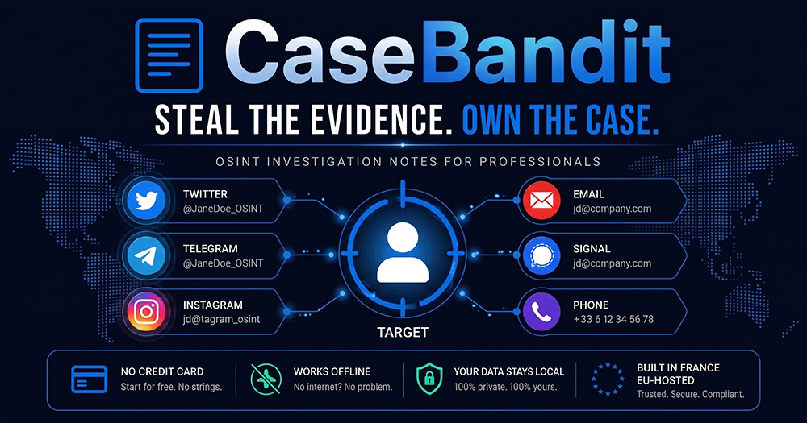
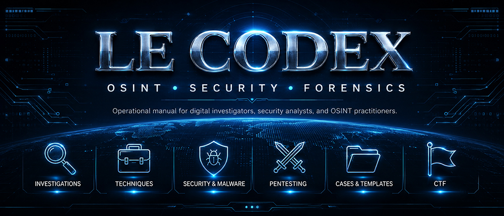
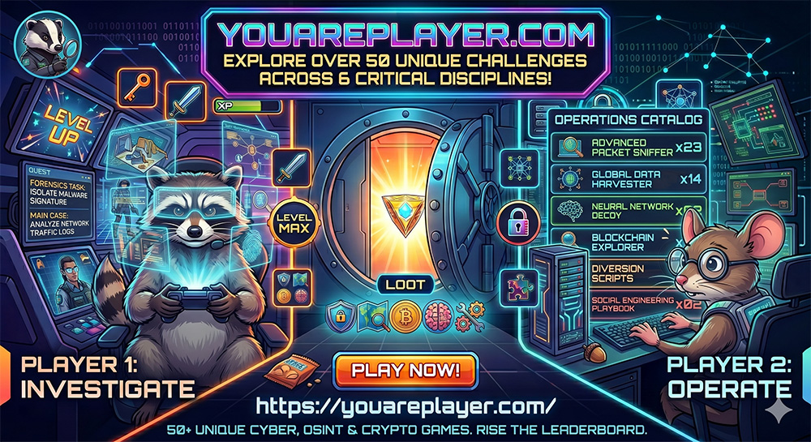

# gl0bal01

**OSINT & security builder creating investigation tools, CTF platforms, AI agents, and practical cyber workflows.**

I build tools, playbooks, bots, and platforms that help people investigate, learn, automate, and solve puzzles.

[Main Links](https://gl0bal01.com/links)

---

## Start Here

- **CaseBandit** — OSINT investigation note-taking app: [casebandit.com](https://casebandit.com)
- **YouArePlayer** — OSINT & cyber challenge platform: [youareplayer.com](https://youareplayer.com)
- **LeCodex** — investigation and security SOPs: [lecodex.xyz](https://lecodex.xyz) - [repo](https://gl0bal01.com/intel-codex)
- **Knowledge base** — cyber, reverse engineering, OSINT, and cheatsheets: [gl0bal01.com](https://gl0bal01.com)
- **Curated links** — OSINT resources and tools: [start.me/u/gl0bal01](https://start.me/u/gl0bal01)

---

## Featured Project: [CaseBandit.com](https://casebandit.com)

**Local-first OSINT investigation notes. Forensic by design.**

CaseBandit is an OSINT investigation note-taking app with local-first architecture, optional cloud sync, and a browser extension for one-shortcut capture.

It combines:

* Auto entity extraction (emails, IPs, domains, phones, handles, ETH/BTC wallets)
* Typed relationships with confidence, direction, and source grading
* Admiralty NATO source grading
* Append-only forensic audit ledger
* Signed PDF/CSV export with chain-of-custody
* Full-text search, timeline, and graph view

[Visit casebandit.com](https://casebandit.com) · [App](https://app.casebandit.com)

---

## Featured Project: [LeCodex.xyz](https://lecodex.xyz)

**The operational manual for digital investigators.**

Intel Codex is a field manual for OSINT practitioners, digital investigators, and security analysts: standard operating procedures you can actually run, not theory.

It covers:

* Platform SOPs — Twitter/X, Instagram, Telegram, Discord, LinkedIn, Reddit, TikTok, Bluesky
* Investigation techniques — entity dossiers, collection logs, chain of custody, OPSEC planning, legal and ethics review
* Image/video OSINT — reverse search, geolocation, metadata
* Infrastructure analysis — web, DNS, WHOIS
* Financial and blockchain tracing — multi-chain, address clustering, bridge read-flow, sanctions, court-admissibility
* Mixer and privacy-pool tracing — CoinJoin clustering, Tornado Cash heuristics, cross-chain obfuscation
* Darkweb investigation — Tor/I2P, marketplace OSINT, vendor PGP pivots, ransomware leak sites
* Malware analysis and penetration testing methods
* Reporting and disclosure — evidence packaging, executive summaries, disclosure protocols
* Sensitive crime intake and escalation routes

All content reflects current best practices and is actively maintained.

[Read the codex](https://lecodex.xyz) · [Online mirror](https://gl0bal01.com/intel-codex) · [Repo](https://github.com/gl0bal01/intel-codex)

---

## Featured Project: [YouArePlayer.com](https://youareplayer.com)

**Crack the code. Think outside the box.**

YouArePlayer is a CTF and OSINT challenge platform built for players, challenge creators, and Discord communities.

It combines:

* Web-based challenge hosting
* Discord bot integration
* OSINT and cyber puzzle workflows
* Score tracking
* Community play
* Creator-friendly challenge publishing

[Play now](https://youareplayer.com) · [About](https://about.youareplayer.com) · [Join Discord](https://discord.gg/T5tc9Rq8DV)

---

## Main Work

### Investigation, OSINT & Intelligence Workflows

* [Intel Codex Vault](https://github.com/gl0bal01/intel-codex) — 41 SOPs for digital investigators, security analysts, and OSINT practitioners.
* [Intel Codex Online](https://gl0bal01.com/intel-codex) — online version of my investigation and security playbooks.
* [DorkHound](https://github.com/gl0bal01/dorkhound) — fast Google dork URL generator for missing persons, Trace Labs, and OSINT investigations.
* [Bookmarklets](https://github.com/gl0bal01/bookmarklets) — curated bookmarklets and shortcuts for OSINT and investigations.
* [Discord OSINT Assistant](https://github.com/gl0bal01/discord-osint-assistant) — multi-tool Discord bot for OSINT gathering and analysis.
* [Discord AWS Rekognition](https://github.com/gl0bal01/discord-amazon-rekognition) — Discord bot using AWS Rekognition for image analysis workflows.
* [chainmap](https://github.com/gl0bal01/chainmap) — fully client-side blockchain fund-flow graph explorer.

### Security, Forensics & CTF Tooling

* [Malware Analysis Claude Skills](https://github.com/gl0bal01/malware-analysis-claude-skills) — malware analysis workflow package from triage to detection rules.
* [pwndocker-reverse](https://github.com/gl0bal01/pwndocker-reverse) — CTF pwn and reverse-engineering Docker image, ready to use.
* [Volatility Toolkit](https://github.com/gl0bal01/volatility-toolkit) — automated Volatility 3 toolkit for Windows, Linux, and macOS memory forensics.
* [ctfd-warboard](https://github.com/gl0bal01/ctfd-warboard) — rate-limited CTFd parser with CLI + Discord bot for small-team CTF collaboration; every action auto-syncs to a shared private git repo.
* [Scripts](https://github.com/gl0bal01/scripts) — practical scripts for steganography, Ghidra workflows, wordlists, CIDR tools, and investigation tasks.

### AI, Agents & Automation

* [Contract Agents](https://github.com/gl0bal01/contract-agents) — AI agent configurations governed by a shared contract to reduce drift and improve consistency.
* [omi](https://github.com/gl0bal01/omi) — static Go CLI for the 1min.ai REST API, with multi-model consensus and Unix-pipe composition.
* [llm-1minai](https://github.com/gl0bal01/llm-1minai) — LLM plugin for 1min.ai with access to 66+ models, web search, mixed context, and persistent options.
* [PAI Hermes](https://github.com/gl0bal01/pai-hermes) — Hermes agent bridge for the PAI ecosystem.
* [PAI Anywhere](https://github.com/gl0bal01/pai-anywhere) — portable PAI setup for shared memory and context across devices.

### Platforms, Bots & Community Tools

* [Discord Judge Bot](https://github.com/gl0bal01/discord-judge-bot) — challenge management, rewards, progress tracking, and automated reward distribution.
* [Discord AI Assistant](https://github.com/gl0bal01/discord-ai-assistant) — AI chat functionality with memory through 1min.ai.
* [Discord Watchlists](https://github.com/gl0bal01/discord-watchlists) — ransomware, CVE, FBI, and Europol alerts inside Discord.
* 🔒 [Decorated](https://github.com/gl0bal01/decorated-issuer) — verifiable-credential badge issuer and holder wallet for [decorated.pro](https://decorated.pro). VC-JWT (RS256), magic-link claim, StatusList 2021 revocation, public JWKS verification.
* 🔒 [YAP Platform](https://about.youareplayer.com) — unified CTF challenge platform with Discord bot and web interface.
* 🔒 Character Hub — private multi-tenant Discord AI persona platform with structured Souls, routing, and durable memory.

### Developer & Infrastructure Tools

* [DevBox](https://github.com/gl0bal01/devbox) — Tailscale-first dev, pentest, and AI station with Traefik, Ollama, Open WebUI, Docker, cosign, SBOM, and SLSA.
* [Terminal Layouts](https://github.com/gl0bal01/terminal-layouts) — single declarative manifest that generates both tmux (tmuxp YAML) and Zellij (KDL) workspaces from one source of truth, with parity enforced in CI.
* [Self-Hosted Secrets Stack](https://github.com/gl0bal01/selfhosted-secrets-stack) — reproducible zero-exposure vault deployment: Passbolt (humans) + Infisical (machines) behind Tailscale.
* [Black Box Architecture](https://github.com/gl0bal01/black-box-architecture) — turn codebases into modular, maintainable black boxes.
* [WP Quick Dev](https://github.com/gl0bal01/wp-quick-dev) — WordPress plugin/theme development setup in under 60 seconds.

---

## Experimental / Lab Projects 🔒

These are projects where I test ideas around automation, content systems, intelligence workflows, agents, and publishing pipelines.

Open lab projects

### Intelligence, Media & Automation

* [Oracle](https://github.com/gl0bal01/brand-search) — French brand intelligence platform for INPI trademark search, brand directories, and sponsored media detection.
* [Scout](https://github.com/gl0bal01/scout-contracts) — merit-based content curation using LLM-scored RSS digests.
* [X-Bot](https://github.com/gl0bal01/x-bot) — autonomous X profile manager.
* [Legend Engine](https://github.com/gl0bal01/legend-engine) — full-auto social presence system.

### Content Pipelines

* [Pocketflow Content Generator](https://github.com/gl0bal01/pocketflow-content-generator) — 7-agent pipeline: Idea, Research, Writer, Image, SEO, Quality, and Publisher.
* [Pocketflow Repurpose Machine](https://github.com/gl0bal01/pocketflow-repurpose-machine) — turns existing content into platform-optimized outputs.
* [Pocketflow Thumbnail Forge](https://github.com/gl0bal01/thumbnail-forge) — click-optimized thumbnails for social platforms.
* [Pocketflow Internal Link](https://github.com/gl0bal01/pocketflow-internal-link) — AI-powered internal linking suggestions for large editorial sites.

### Docusaurus

* [docusaurus-plugin-obsidian-vault](https://github.com/gl0bal01/docusaurus-plugin-obsidian-vault) — integrate an Obsidian vault with Docusaurus.
* [docusaurus-plugin-multi-rss](https://github.com/gl0bal01/docusaurus-plugin-multi-rss) — aggregate multiple RSS feeds into a Docusaurus site.

### Other

* [Cygnus Trading Framework](https://github.com/gl0bal01/cygnus) — multi-strategy trading framework for Interactive Brokers.
* [Zero-Trust Lifestyle](https://github.com/gl0bal01/zero-trust-lifestyle) — Bash scripts for paranoid developer workflows.
* 🔒 [Spectrum Gene Explorer](https://github.com/gl0bal01/spectrum-gene-explorer) — non-diagnostic gene–phenotype literature navigator for autism, built on HPO + SFARI data with ranked candidate genes and source citations.

---

## Intel Codex

Intel Codex is my structured knowledge base for investigation, OSINT, cyber analysis, and operational workflows.

* [Investigations](https://gl0bal01.com/intel-codex/category/investigations)
* [Investigation Techniques](https://gl0bal01.com/intel-codex/category/investigation-techniques)
* [Security Analysis SOPs](https://gl0bal01.com/intel-codex/Security/Analysis/Analysis-Index)
* [Penetration Testing SOPs](https://gl0bal01.com/intel-codex/Security/Pentesting/Pentesting-Index)

Repository: [github.com/gl0bal01/intel-codex](https://github.com/gl0bal01/intel-codex)

---

## Community

I run a Discord community and CTF platform for people who like OSINT, cybersecurity puzzles, investigations, and capture-the-flag challenges.

The goal is simple: play, learn, build, and contribute useful challenges.

[Learn & Play](https://youareplayer.com) · [Join Discord](https://discord.gg/T5tc9Rq8DV)

---

<!-- blog-post start -->
## Latest Blog Posts

- **[chainmap: Turn On-Chain Transactions Into a Fund-Flow Graph](https://gl0bal01.com/blog/chainmap)** - chainmap turns a wallet address into an interactive fund-flow graph, entirely in your browser. Follow the money on-chain without living in twenty Etherscan tabs. Live at chainmap.gl0bal01.com....
- **[Free Encrypted Postgres Backups to Cloudflare R2](https://gl0bal01.com/blog/free-postgres-backup-r2-cloudflare)** - Set up automated, encrypted, off-site daily PostgreSQL backups to Cloudflare R2 within the free tier using a sidecar container, rclone, and client-side encryption....
- **[Intel Codex v2.0: 41 SOPs, Cloud Forensics, and Blockchain Tracing](https://gl0bal01.com/blog/intel-codex-v2)** - Intel Codex v2.0 expands to 41 SOPs with 11 new procedures covering cloud forensics, SaaS log analysis, blockchain tracing, mixer attribution, and container/Kubernetes pentesting....
- **[pwndocker-reverse: One Docker Image for CTF Pwn and Reverse Engineering](https://gl0bal01.com/blog/pwndocker-reverse)** - A single Dockerfile with 45+ pwn and reverse-engineering tools — 7 disassemblers, 3 GDB plugins with instant switching, AFL++, frida, and a pre-populated command history. Rebuilt weekly and signed wit...
- **[Volatility Toolkit v2: Automated Memory Forensics for Windows, Linux, and macOS](https://gl0bal01.com/blog/volatility-toolkit)** - Automated Volatility 3 wrapper for Windows, Linux, and macOS memory dumps. Auto-detects OS, runs 30/21/20 plugins in parallel, extracts IOCs, generates structured reports with chain-of-custody checksu...

[**View More →**](https://gl0bal01.com/blog/)
<!-- blog-post end -->

---

<!-- releases start -->
## Latest Releases

- [devbox Weekly rebuild weekly-20260817](https://github.com/gl0bal01/devbox/releases/tag/weekly-20260817) - 2026-08-17
- [ctfd-warboard v0.4.1](https://github.com/gl0bal01/ctfd-warboard/releases/tag/v0.4.1) - 2026-07-13
- [chainmap v1.0.1](https://github.com/gl0bal01/chainmap/releases/tag/v1.0.1) - 2026-07-13
- [discord-osint-assistant v2.3.0 — Blockchain Tracer, Testnets & Reports Archive](https://github.com/gl0bal01/discord-osint-assistant/releases/tag/v2.3.0) - 2026-07-09
- [pai-anywhere v0.2.4 — security & code review remediation](https://github.com/gl0bal01/pai-anywhere/releases/tag/v0.2.4) - 2026-07-03

*Showing 5 of 25 releases* • [View More →](RELEASES.md)
<!-- releases end -->

---

## Working Principles

* Build practical tools, not only ideas.
* Make investigation workflows easier to repeat.
* Prefer clear SOPs, reproducible methods, and useful defaults.
* Share knowledge when it can help others learn or build.
* Keep experimenting.

> Build useful tools. Document the process. Share the knowledge.

---

## Achievements

Some fun GitHub badges and milestones live here: [Achievements →](Achievements.md)

<!-- my-badges start -->

<!-- my-badges end -->

## Contact

For collaboration, challenge creation, or OSINT/security projects: **gl0bal01@proton.me**
